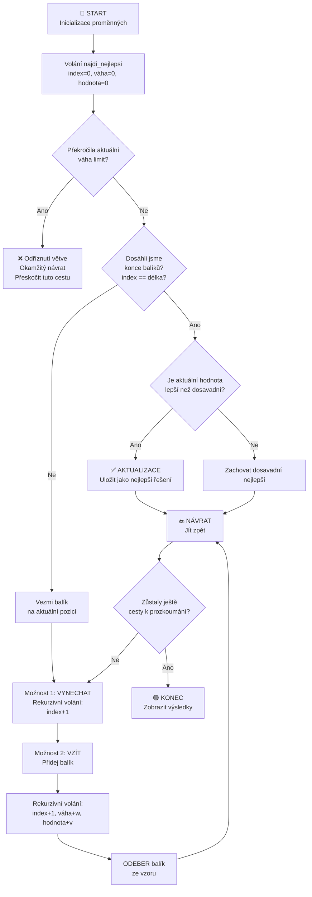

# Řešitel problému batohu 0/1 - Běh programu

## 📊 běh algoritmu



---

## 🎯 Postupný běh

### Počáteční nastavení
- **Balíky**: 7 položek (A-G) s váhou a hodnotou
- **Limit váhy**: 120 kg
- **Cíl**: Maximalizovat celkovou hodnotu

| Balík | Váha (kg) | Hodnota (Kč) |
|-------|-----------|-------------|
| A     | 40        | 900         |
| B     | 30        | 700         |
| C     | 50        | 1200        |
| D     | 20        | 400         |
| E     | 10        | 200         |
| F     | 25        | 500         |
| G     | 35        | 800         |

### Rekurzivní funkce: `najdi_nejlepsi()`

**Parametry:**
- `index`: Aktuálně zvažovaný balík (0 až délka seznamu)
- `aktualni_vaha`: Aktuální celková váha v batohu
- `aktualni_hodnota`: Aktuální celková hodnota v batohu
- `vybrany_vyber`: Seznam vybraných balíků

**Logika algoritmu:**

1. **Kontrola odříznutí větve**: Pokud váha překročí 120 kg → návrat (neprohledávej tuto cestu)
2. **Základní případ**: Pokud jsme zpracovali všechny balíky → aktualizuj nejlepší řešení, pokud je lepší
3. **Rekurzivní případ**: Pro každý balík zkus dvě možnosti:
   - **Možnost 1 (Vynechat)**: Jdi na další balík bez jeho brání
   - **Možnost 2 (Vzít)**: Přidej balík do batohu a jdi dál
   - **Návrat**: Odeber balík poté, co jsi prozkoumala cestu "vzít"

---

## 🔄 Příklad stromu provádění (zjednodušeno)

```
Úroveň 0: Start (0 balíků zváženo)
├─ Balík A se nebere → Úroveň 1
│  └─ Balík B se nebere → Úroveň 2
│     └─ ... zkoumání všech zbývajících kombinací
│
└─ Balík A se vezme (váha: 40, hodnota: 900) → Úroveň 1
   ├─ Balík B se nebere → Úroveň 2
   └─ Balík B se vezme (váha: 70, hodnota: 1600) → Úroveň 2
      └─ ... pokračování zkoumání kombinací
```