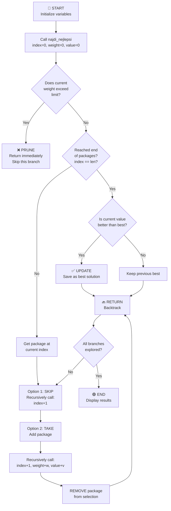

# 0/1 Knapsack Problem Solver - Program Flow

## 📋 Overview
This program solves the **0/1 Knapsack Problem** using a **recursive backtracking algorithm**. It finds the optimal combination of packages that maximizes value while staying within a weight limit.

---

## 📊 Algorithm Flow Diagram



---

## 🎯 Step-by-Step Execution

### Initial Setup
- **Packages**: 7 items (A-G) with weight and value
- **Weight Limit**: 120 kg
- **Goal**: Maximize total value

| Package | Weight (kg) | Value (Kč) |
|---------|------------|-----------|
| A       | 40         | 900       |
| B       | 30         | 700       |
| C       | 50         | 1200      |
| D       | 20         | 400       |
| E       | 10         | 200       |
| F       | 25         | 500       |
| G       | 35         | 800       |

### Recursive Function: `najdi_nejlepsi()`

**Parameters:**
- `index`: Current package being considered (0 to len(packages))
- `aktualni_vaha`: Current total weight in knapsack
- `aktualni_hodnota`: Current total value in knapsack
- `vybrany_vyber`: List of selected packages

**Algorithm Logic:**

1. **Pruning Check**: If weight exceeds 120 kg → return (don't explore this branch)
2. **Base Case**: If we've considered all packages → update best solution if better
3. **Recursive Case**: For each package, try two options:
   - **Option 1 (Skip)**: Move to next package without taking it
   - **Option 2 (Take)**: Add package to knapsack and move to next
   - **Backtrack**: Remove the package after exploring the "take" branch

---

## 🔄 Example Execution Tree (Simplified)

```
Level 0: Start (0 items considered)
├─ Package A not taken → Level 1
│  └─ Package B not taken → Level 2
│     └─ ... explores all remaining combinations
│
└─ Package A taken (weight: 40, value: 900) → Level 1
   ├─ Package B not taken → Level 2
   └─ Package B taken (weight: 70, value: 1600) → Level 2
      └─ ... continues exploring combinations
```

---

## ⏱️ Output Example

```
Time: X.XXX ms
OPTIMAL LOAD
------------------------
Selected packages:
Package C  (50 kg, 1200 Kč)
Package A  (40 kg, 900 Kč)
Package B  (30 kg, 700 Kč)
------------------------
Total weight: 120 kg
Total value: 2800 Kč
```

---

## 🎓 Key Concepts

| Concept | Explanation |
|---------|------------|
| **Backtracking** | Explores all possible combinations by branching and pruning invalid paths |
| **Pruning** | Early termination if weight limit is exceeded (optimization) |
| **Global Variables** | Tracks best value and best selection across all recursive calls |
| **Time Complexity** | O(2^n) where n = number of packages (explores all combinations) |
| **Space Complexity** | O(n) for recursion stack depth |

---

## 📈 Why This Algorithm?

- ✅ **Guarantees optimal solution** (tries all valid combinations)
- ✅ **Prunes branches** to avoid exploring invalid paths
- ✅ **Works for 0/1 constraint** (each item either taken or not)
- ⚠️ **Can be slow** for large datasets (exponential time complexity)

*For production use with 20+ items, consider **Dynamic Programming** approach instead.*
